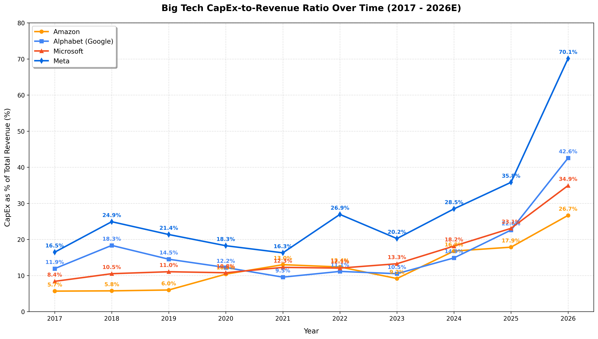

# Big Tech CapEx Analysis

This repository contains a small Python script that visualizes the CapEx-to-Revenue ratio for major Big Tech companies (Amazon, Alphabet, Microsoft, Meta) from 2017 to 2026 (est.). The plot is saved to the `assets/` folder and embedded below.

## Files
- `bigtech_capex.py` — Loads hardcoded revenue and CapEx figures, computes CapEx/Revenue (%), and plots the time series. The script now saves the plot to `assets/capex_to_revenue_ratio.png`.
- `assets/` — Directory created automatically by the script to store generated plot images.

## Prerequisites
- Python 3.8+
- Packages: pandas, matplotlib

Install packages:

```
pip install pandas matplotlib
```

## Usage
Run the script from the repository root:

```
python bigtech_capex.py
```

The script will create the `assets/` directory (if missing) and save the plot at:

`assets/capex_to_revenue_ratio.png`

It will also show the plot interactively when run locally.

## Output



## Notes
- Data are hardcoded for illustrative purposes. Replace with real data loading for production use.
- The saved image is PNG at 300 DPI.

## License
MIT
