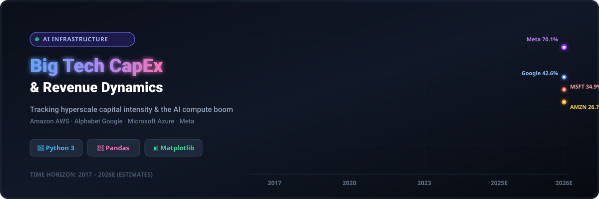

<p align="center">
  
</p>

# 🚀 Big Tech CapEx Analysis & AI Infrastructure Spending (2017–2026E)

<p align="center">
  <a href="https://github.com/ishandutta2007/Awesome-Awesome-Awesome"></a>
  <a href="https://discord.gg/jc4xtF58Ve"></a>
  <a href="https://www.python.org/"></a>
  <a href="LICENSE"></a>
  <a href="#"></a>
  <a href="https://github.com/ishandutta2007"></a>
</p>

A comprehensive Python data analysis and visualization tool tracking the **Capital Expenditure (CapEx) to Revenue ratios** and **AI infrastructure spending** trends for hyperscale tech leaders: 📦 **Amazon (AWS)**, 🌐 **Alphabet (Google)**, 💻 **Microsoft (Azure)**, and ♾️ **Meta** from 2017 through 2026 (estimated).

---

## 📌 Overview & Key Insights 💡

The race for Generative AI compute, GPU clusters, and hyperscale data centers has triggered historic capital investments across the tech sector. This repository analyzes and visualizes:

- 📊 **Historical CapEx Trends (2017–2024)** across major cloud and tech giants.
- ⚡ **Estimated AI CapEx Surges (2025–2026E)** as infrastructure demands accelerate.
- 🎯 **CapEx-to-Revenue Efficiency Ratio (%)** comparing capital intensity across Big Tech peers.

### 📊 CapEx-to-Revenue Ratio Trends 📈


---

## 📈 Summary Data & Metrics (2017 vs 2026E) 🔬

| Company | 2017 CapEx / Rev (%) | 2026E CapEx / Rev (%) | Primary CapEx Drivers 🏗️ |
| :--- | :--- | :--- | :--- |
| 📦 **Amazon** | ~5.7% | ~26.7% | AWS Data Centers, AI Chips (Trainium/Inferentia), Logistics 🚚 |
| 🌐 **Alphabet (Google)** | ~11.9% | ~42.6% | Google Cloud, TPU Infrastructure, Gemini Model Training 🧠 |
| 💻 **Microsoft** | ~8.4% | ~34.9% | Azure Cloud, OpenAI Supercomputers, Global Data Center Expansion ☁️ |
| ♾️ **Meta** | ~16.5% | ~70.1% | Llama Model Development, Custom Silicon (MTIA), AI Infrastructure 🤖 |

---

## 📂 Repository Structure 🗂️

- 🐍 [`bigtech_capex.py`](file:///C:/Users/ishan/Documents/Projects/Big-Tech-CapEx/bigtech_capex.py) — Python script that computes CapEx-to-Revenue ratios (%) using Pandas and generates publication-ready high-resolution plots via Matplotlib.
- 🖼️ `assets/` — Auto-generated output directory containing dynamic banners, high-resolution charts (`capex_to_revenue_ratio.png` at 300 DPI), and social preview media.

---

## 🚀 Getting Started 🛠️

### 📋 Prerequisites

- 🐍 Python 3.8 or higher
- 🐼 `pandas`
- 📊 `matplotlib`

### 📦 Installation

Clone the repository and install the dependencies:

```bash
git clone https://github.com/ishandutta2007/Big-Tech-CapEx.git
cd Big-Tech-CapEx
pip install pandas matplotlib
```

### ⚙️ Running the Analysis

Execute the Python script from the project root:

```bash
python bigtech_capex.py
```

The script will automatically calculate the ratios, save the 300 DPI plot to `assets/capex_to_revenue_ratio.png`, and display the interactive chart window.

---

## 🔍 Keywords & Topics 🏷️

`Big Tech CapEx`, `Capital Expenditure Analysis`, `AI Infrastructure Spending`, `Hyperscale Cloud CapEx`, `CapEx to Revenue Ratio`, `Financial Data Visualization`, `Amazon AWS CapEx`, `Microsoft Azure CapEx`, `Google Cloud Alphabet CapEx`, `Meta AI CapEx`, `Data Science Python`, `Pandas`, `Matplotlib`.

---

## 🌟 Star History

[](https://star-history.dera.page/#ishandutta2007/Big-Tech-CapEx&type=date&legend=top-left)

---

## 📄 License 📜

This project is licensed under the [MIT License](LICENSE).


